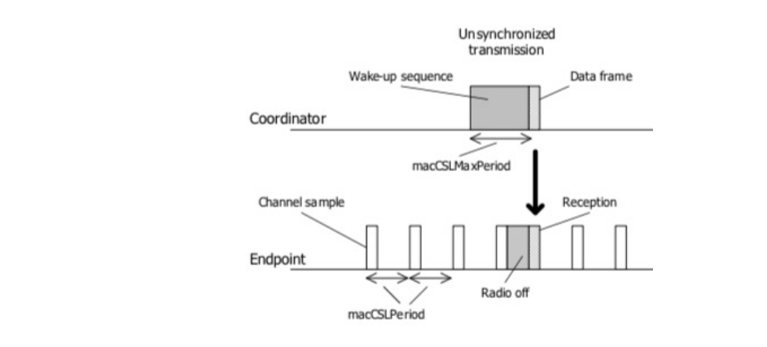
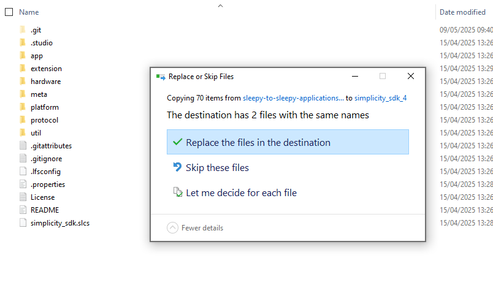

# Introduction

The Zigbee Sleepy-to-Sleepy (S2S) feature is the implementation of the 
IEEE 15.4 unsynchronized Coordinated Sample Listening (CSL) 
feature, as defined in the IEEE 802.15.4-2015 specification. 
Using two sleepy end devices, this feature allows one device to 
transmit using a preceding wake-up frame sequence, and a 
receiver to act on the wake-up frames to receive a final, 
coordinated payload

The following image demonstrates how an unsynchronized CSL transmission works with wake-up frames

Some important points

* S2S devices are not certifiable as Zigbee devices
* A S2S receiver cannot be woken-up by a standart Zigbee packet 
* A S2S command using wake-up frame can be received by a standart Zigbee router when same network parameters are used
* When a S2S receiver receives a S2S command, it reboroadcasts this command using standart Zigbee format (No wake-up frame)
* No meshing is done on S2S network.
* Any ZCL packet sent by a S2S initiator will use a wake-up frame (group, on-off, etc)

Sometimes a S2S receiver needs to receive commands not only from a S2S transmitter but also from an nearby Zigbee network. Multi-network feature of our Zigbee stack is a way to achieve this requirement. In this tutorial, we are going to cover this need. 

# Prerequisites

A s37 file for BRD4194A implementing multi-network functionnality is available [here](binary/zigbee_ble_sleepy_to_sleepy_shades_2025-6.s37). 
Don't forget to flash a bootloader.

## What you need

  1.  SiSDK 2025.6.0 or newer installed on your machine.

  2.  Sleepy2Sleepy package associated to the SiSDK version used. This is an on-demand package. You need to ask SiliconLabs support to get this package.

         
## Setup of S2S package

Once SiSDK 2025.6.0 or newer is installed on your machine

  1.  Close Simplicity Studio

  2.  Unzip the S2S package. It should contain a protocol folder. Copy this folder to the SiSDK folder.
You will be asked if you want to overwrite existing file in SDK, select "Yes".

  3.  Restart SimplicityStudio

