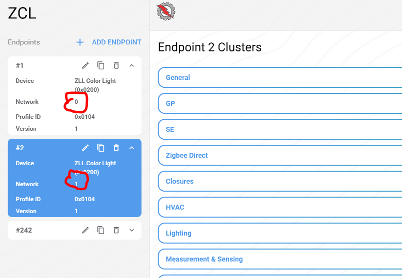

## Create a SleepyToSleepy Shade application

If you have correctly installed the S2S package you should be able to access the following shade example:


Select this example, it will be used as a basis for our S2S + ZSED application.

## Modify the example to work with multi-network

In application the S2S profile will be on network interface 0 and the ZSED profile will be on network interface 1. 

The following components needs to be added to the example:

* **Multi network**
* **Network Steering**

The following components need to be modified:

* **End Device Support**  -> Set the ZSED parameters to what is required by your application)
* **Zigbee Device Config**  -> Add a secondary network as shown below:


Multi-network feature is not compatible with ZLL functionality. You need to remove all the ZLL relative components:

* **ZLL Commissioning Common**
* **ZLL Commissioning Server**
* **ZLL Identify Server**
* **ZLL Utility Server Cluster**
* **Zigbee light link**
* **Zigbee Light Link (Library)**

**On BRD4194A, you will need to remove the "Simple Led" component and its instance otherwise application will crash.**

To evaluate low power feature, you need to:

* Remove the **"Zigbee LCD Display"**
* Select **"USART0"** instead of **"EUSART0"** for the "vcom " component

With **ZAP tool**, an endpoint needs to be created for the secondary network with all the clusters needed by your application:



## Modify the application code

In app.c add the following code:

```C
void buttonEventHandler(sl_zigbee_af_event_t * event)
{
  sl_zigbee_af_event_set_inactive(buttonEvent);

  if (lastButton == BUTTON0) {
     sl_status_t status = sl_zigbee_af_push_network_index(1);
     sl_zigbee_network_status_t state = sl_zigbee_network_state();
     uint8_t index = sl_zigbee_get_current_network();
     sl_zigbee_af_app_println("Net %d state: %d, status: %d", index, state, status);
     if (state == SL_ZIGBEE_NO_NETWORK)
     {
       sl_zigbee_af_network_steering_start();
     }
     else
     {
       sl_zigbee_af_fill_external_buffer((ZCL_CLUSTER_SPECIFIC_COMMAND
                                          | ZCL_FRAME_CONTROL_CLIENT_TO_SERVER),
                                         ZCL_ON_OFF_CLUSTER_ID,
                                         ZCL_TOGGLE_COMMAND_ID,
                                         "");
       sl_status_t status;
     #if SEND_MULTICAST
            sl_zigbee_af_get_command_aps_frame()->profileId           = sl_zigbee_af_profile_id_from_index(0);
            sl_zigbee_af_get_command_aps_frame()->sourceEndpoint      = sl_zigbee_af_endpoint_from_index(0);
            status = sl_zigbee_af_send_command_multicast_to_bindings();
            sl_zigbee_af_app_println("Sent to multicast group: 0x%02X", status);

     #else
            sl_zigbee_af_get_command_aps_frame()->sourceEndpoint = 2;
            sl_zigbee_af_get_command_aps_frame()->destinationEndpoint = 1;
            sl_zigbee_af_fill_command_on_off_cluster_toggle();
            index = sl_zigbee_get_current_network();
            status = sl_zigbee_af_send_command_unicast(SL_ZIGBEE_OUTGOING_DIRECT, 0x0000);
            sl_zigbee_af_app_println("Net %d status: %d", index,  status);
            sl_zigbee_af_app_println("Sent to unicast: 0x%02X", status);
     #endif
     }
     status = sl_zigbee_af_pop_network_index();
  } else if (lastButton == BUTTON1) {
```

## Test the application 

### Leave any previously joined network

To leave network, either erase flash of your device before flashing or use the followings CLI commands:

```bash
> net set 0
> leave

> net set 1
> leave
```

### Join a S2S network on interface O

```bash
> net set 0
> custom s2s-commission 0 15 3 0xabcd 0x2222
```

### Join a S2S network on interface 1

Just press button 0 of brd4194a to join an openned network with interface 1

